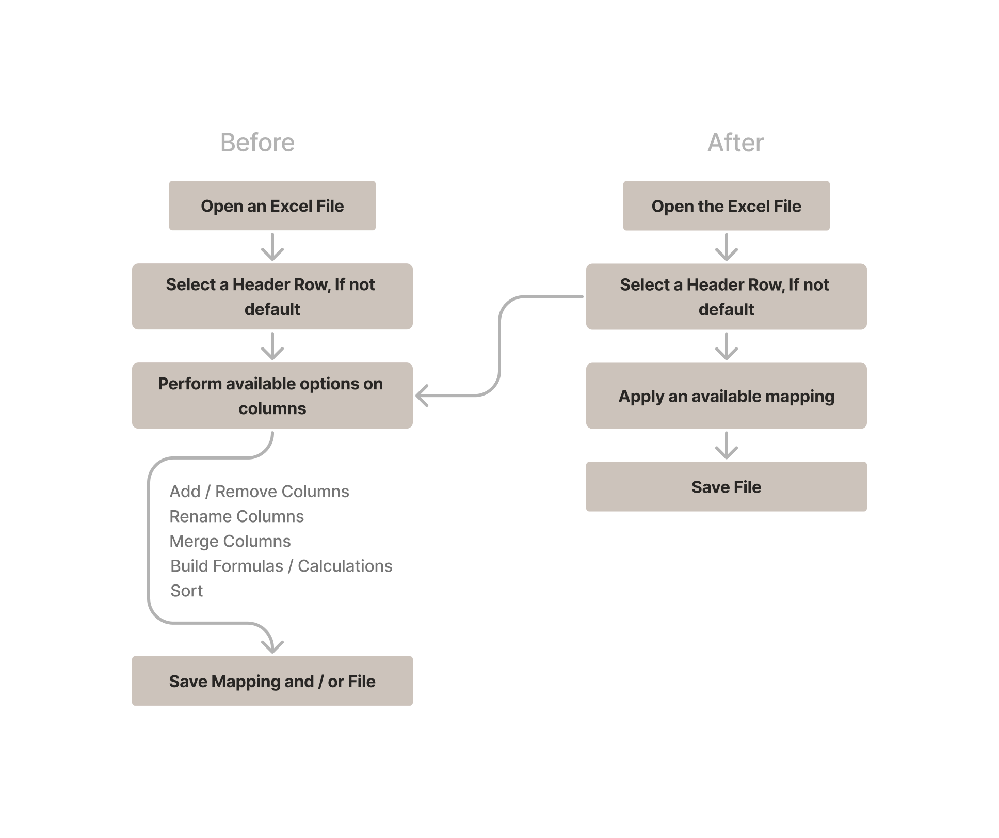

# ExcelFileMappingEngine

A tool that automates the boring, repetitive parts of cleaning up Excel files — built with C#, WPF, and PostgreSQL.

## About the Project

This tool is being developed for anyone who deals with Excel files daily and keeps doing the same boring stuff over and over — deleting the same columns, running the same calculations, cleaning up the same mess. Instead of repeating the same manual work every time, you create a mapping once. From then on, the application simply follows that mapping — like a recipe — to transform similar files in just a few clicks.

The idea came from my own job. I kept having to reshape the same Excel files before sending them to clients or coworkers, or before using them myself. It's not a hard task, just a repetitive and annoying one — so I decided to use what I was learning in programming to build something that would do it for me.

It's also become a great learning project along the way. I'm using it to practice writing clean, well-structured code, and to try out new tools — like PostgreSQL, which turned out to be a great fit here thanks to its jsonb column type.

## What does it do

The first time you work with a new type of file:

1. 📂 **Open** an Excel file in the application.
2. 🔎 **Identify** and select the header row containing column names.
3. 🛠️ **Transform** the data using available operations.
4. 💾 **Save** the transformation steps as a reusable mapping.
5. 📤 **Export** the processed file if needed.

The next time you get a similar file:

1. 📂 **Open** the file in the application.
2. 🔍 The application **identifies** the file type and suggests available mappings.
3. ⚙️ **Apply** an existing mapping, or ✨ create a new mapping by defining transformation steps.
4. 📤 **Export** the processed file.

## Current Development Status and Features

🚧 Actively being built.

### 📄 File handling
- Open an Excel file in the app
- Keep the original data safe while working (allowing you to restart without reopening the file)
- Change the header row and reload the data + available mappings
- Open a different file while fully clearing the previous session

### ✏️ Data transformations
- Delete one or multiple columns
- Rename a column
- Add a new column to the left or right of a selected one
- Merge two selected columns with a custom separator
- Create formulas using basic calculations and supported Excel functions (currently includes ROUND)
- Sort by a chosen column, ascending or descending
- Change a column's data type *(currently needs improvement)*

### 💾 Mapping & persistence
- Save every applied step as a JSON structure
- Save mappings to a PostgreSQL database

### 🔍 File recognition
- Generate a file fingerprint from header columns and convert it into a hash
- Save file definitions (fingerprint, hash, name) to the database
- Compare an opened file's hash against stored definitions to find matching mappings

## 🏗️ Architecture, Technology & Design Decisions

The project started as a functional prototype to validate the main idea and workflow. As new features were added, the application was gradually refactored into a cleaner and more maintainable structure.

The main goal of the refactoring was not only to make the code work, but to create clear responsibilities between components, reduce dependencies, and build a foundation that can be extended with future functionality.

### Application structure

The application follows a layered architecture approach:

**Main components:**

- **WPF UI** — handles user interaction and visual presentation.
- **AppManager** — coordinates application workflows and connects the UI with application logic.
- **Services** — contain the core application operations:
  - **FileService** — handles file loading and file-related operations;
  - **DataService** — manages data transformations and in-memory data manipulation;
  - **MappingService** — manages creation, storage, and application of reusable mappings.
- **Repositories** — handle communication with the database and data persistence.
- **DataSession** — acts as a container for the current working context. It contains state models such as **FileState** and **DataState**, which store information about the opened file, loaded data, mappings, and related metadata.

The architecture separates the current working data from reusable transformation definitions. Changes made during a session affect the working dataset, while transformation steps can be saved as mappings and applied again to similar files.

### Technology stack

- **C# / .NET + WPF** — desktop application framework.
- **PostgreSQL** — database for storing mappings and file definitions.
- **Dapper** — data access layer for database communication.
- **ClosedXML** — Excel file processing library.
- **JSON / PostgreSQL jsonb** — storing reusable mapping definitions.
- **Git** — version control.

### Why ClosedXML?

Since working with Excel files is the main part of this project, choosing a suitable library was an important step.

I looked at several available options and compared them based on how easy they are to use and how well they fit the needs of this project. ClosedXML stood out because it has a simple and clear way of working with Excel files.

For this project, ClosedXML turned out to be a very good choice, and I would consider using it again in the future.

### Why PostgreSQL?

PostgreSQL was chosen because it combines the advantages of a relational database with flexible JSON storage.

Application mappings are stored as structured JSON data. PostgreSQL's `jsonb` data type provides a convenient way to store these definitions while still keeping the benefits of a relational database.

This approach allows mappings to be stored, retrieved, and extended without requiring a separate database structure for every possible transformation type.

## 🚀 Future Plans

### 🔹 Short term

✅ **Add unit tests**
As the project grows, tests will help make sure new changes do not break existing features.

📝 **Add error logging**
Store errors and important events in the database, so problems are easier to find and fix.

✔️ **Add data validation**
Make sure imported files have the expected structure and keep the data clean.

🔄 **Improve mapping management**
Make it easier to create, edit, save, and reuse mappings. The goal is that users can prepare a file once and repeat the same process later with just a few clicks.

🧩 **Add more transformation options**
Support more advanced actions, such as splitting columns, conditional changes, and other data preparation steps.

### 📄 Header & footer support

Currently, all data is handled in one table. The next step is to separate the file into different parts:

* **Header** — information above the main data section
* **Data** — the actual table content
* **Footer** — summary rows, calculations, or additional information

These parts will be managed separately while editing and combined again when saving the final Excel file.

### 🔍 External lookup files

Users will be able to add reference files to help fill in missing information automatically.

For example, instead of manually adding a customer's assigned agent, the application could look it up from a company-provided list.

### 🌐 Long term — web version

The long-term goal is to turn this into a web application where users can create an account and use the tool directly from a browser.

The current refactoring work supports this goal by keeping the user interface separate from the main application logic and giving each part a clear responsibility.

This is the first project where I am not only learning about clean architecture, but actually applying it because I want to build something that could become a useful tool — not just a learning exercise.

## 🎯 Goal

Build a flexible tool that removes repetitive manual work from Excel file preparation.

The goal is to create something that is useful in real work situations today, while also improving my skills in building clean, maintainable, and scalable software.

💡 Have feedback or ideas? Issues and suggestions are welcome!

